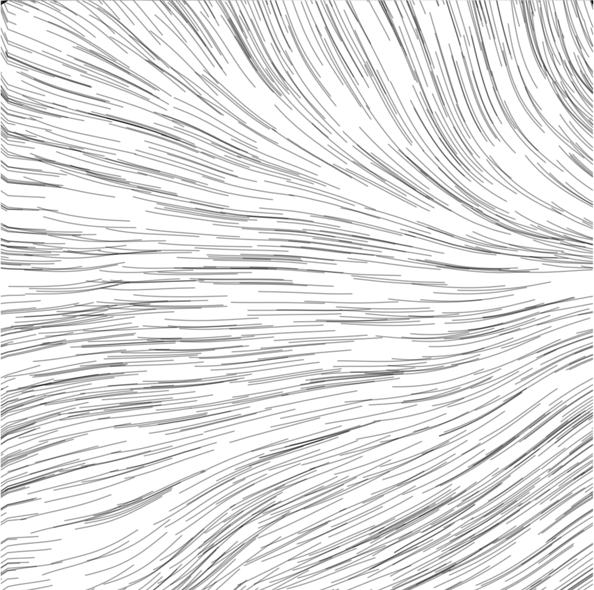
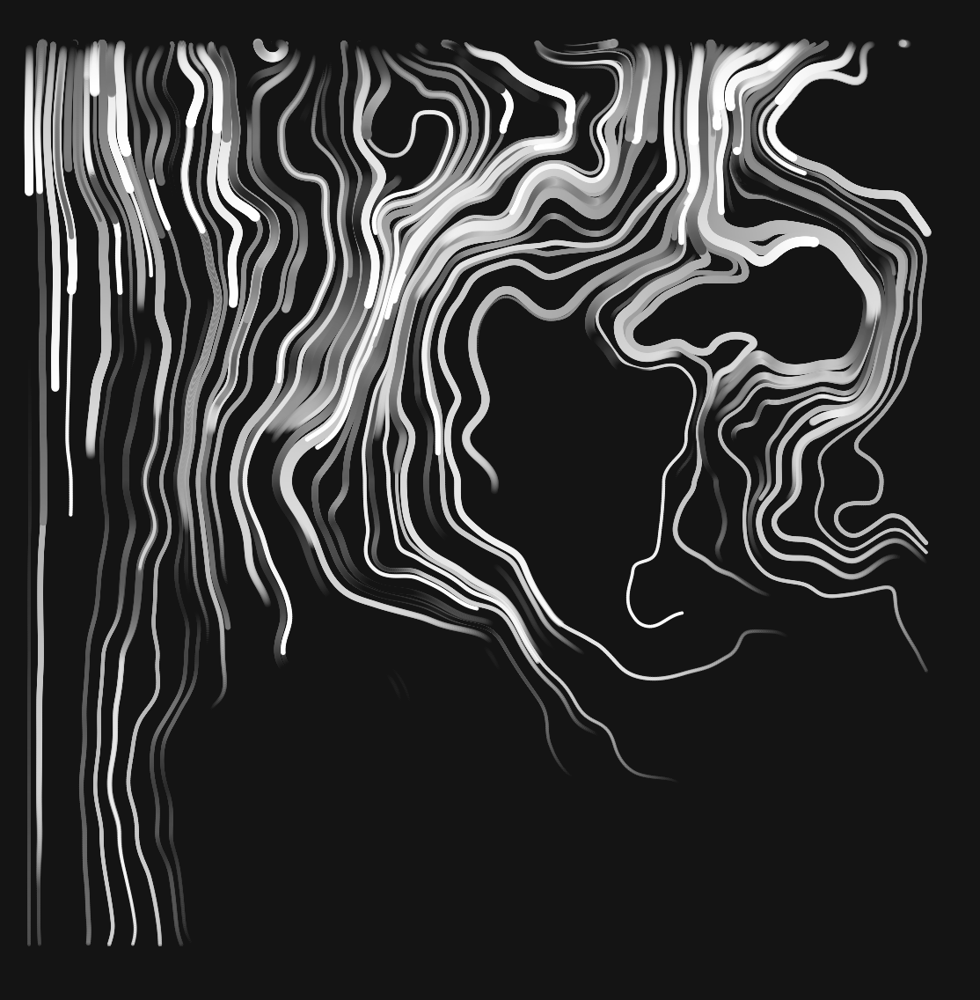

# Group A_Creative coding major project_9103_tut5

## Section 1 – Research and inspiration:

When imitating Anwar Jalal Shemza's The Apple Tree, there are several directions to draw inspiration from to help us go about forming the visuals and structure of the code implementation. Below is a brief description of several design-inspiring elements and related concepts:

**1-1 Visual representation of geometric abstract art**

Shemza's Apple Tree uses simple geometric shapes to express complex ideas. This geometric abstract art emphasises shape, symmetry and spatial layout. These geometric patterns can be used in code design to create a similar visual effect through the arrangement of simple shapes such as squares, arcs and rectangles.

We found Okazz's work has a unique style that combines geometric abstraction, soft curves and dynamic visuals to create organic forms through complex generative rules. This style can inspire we to:

1. A sense of static growth
Using algorithms such as Perlin Noise to generate natural curves can give an image a sense of flow, giving static images a soft, natural dynamic feel.

2. Layers and Space
Okazz's geometric compositions are layered, adding visual depth through transparency and repetitive structures. We can use geometric shapes of different sizes superimposed on each other, or adjust the transparency and colour of the shapes to create a sense of layering, making the image complex and coordinated, in line with the abstract qualities of ‘Apple Tree’.

3. Precise control of randomisation
Okazz is good at controlling random geometrical generation, so that the graphics are random and orderly at the same time. We can use random parameters in the code to generate a variety of tree structures, and at the same time, we can use specific rules (e.g. symmetry or repetition) to make the images not look cluttered. This retains the richness of generative art, but also conforms to the balanced aesthetics of static images.

4. Harmonious colour gradients
Okazz often uses gradients and rich colours to enhance the depth of the work. We can introduce gradient tones or layered shading into the code to add visual tension to geometric forms, making patterns appear both abstract and harmonious. Colour gradients and subtle tones can help us achieve a subdued effect like The Apple Tree.

5. Balance of randomisation and control
Okazz maintains a delicate balance between controlled graphic variation and randomness, creating an aesthetic of ‘disorder within order’. In our projects, we can introduce noise-controlled randomisation parameters to create balanced but natural tree structures that add visual interest and variety.

These techniques will help our code implementation of The Apple Tree give a natural and harmonious structure while retaining the unique depth of generative art.

**1-2 The examples of Okazz**

[The link of Okazz's works](https://openprocessing.org/user/128718?view=sketches&o=32/)

**2-1 Okazz_Japanese generative artist and creative coder**

We're going to use Perlin noise to create a background intended to mimic the background texture of Anwar Jalal Shemza's Apple Tree to add depth and layering. By generating a noise pattern with a certain regularity, it creates an effect similar to natural textures, making the background richer without being eye-catching.

**2-2 The examples of Perlin noise redux edit**

[The link of perlin noise redux edit 1 from Degox Art's work](https://openprocessing.org/sketch/1317868/)

[The link of perlin noise redux edit 2 from scott mayson's work](https://openprocessing.org/sketch/1895683/)

## Section 2 – Technical planning:

