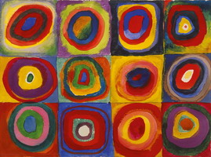

# jilu0503_Group A_Creative coding major project_9103_tut5

## Section 1 – Instructions on how to interact with the work

This work interacts with the user in several ways:
Time-driven step-by-step drawing: the animation presents all the circles and rectangles step-by-step as the page loads. The user does not need to click, just wait and the animation will be displayed in chronological order. There is a delay of 200 milliseconds after each circle or rectangle is drawn, which makes the animation effect smoother and more gradual.

Choosing time-based as the driving and animating image attribute
I chose time-based as the main way to drive my personal code. This means that the progression and change of animation is dependent on the passage of time rather than direct user interaction.

## Section 2 – Animated properties

2.1. The drawNextCircle function controls the rhythm of the animation by drawing circles one by one with a setTimeout delay. After each circle is drawn, it waits 200 milliseconds before drawing the next circle. On the first draw, fixed colours (red, green, yellow) are used to depict the top and bottom halves of the circle, and random colours are used on subsequent draws. This approach allows for multiple drawing variations for each figure, increasing the sense of dynamism and better showing the growth of the apple tree.

2.2. While other team members may use interactive drivers (e.g. mouse clicks, movement), my work relies entirely on timelapse delays and built-in noise functions to dynamically generate effects, which allows my animation to show a gradual unfolding of subtle and continuous changes. My work focuses more on the gradual rendering and animation of shapes driven by time delays and fading effects, as opposed to the more instantaneous interactive responses that may be used.

## Section 3 – Reference animation inspiration
My code is inspired by the following:
3.1 Frame-by-frame animation and fading: I referenced a number of progressive animation works, particularly those that present shapes progressively through a chronological sequence. By drawing graphics frame-by-frame and delaying them using functions such as setTimeout, similar to classic animation techniques, a sense of rhythm and change is created by using gradual drawing. This approach is similar to traditional animation or early computer animation styles, where each frame is drawn incrementally to create the image. [The link of Frame-by-frame animation](https://pin.it/Ly0MvNJYS/)

3.2.Artist's work: I am influenced by abstract artists such as Wassily Kandinsky and Paul Klee, whose work often shows a combination of geometric shapes and gradient colours in their compositions and use of colour. With these inspirations, I hope to combine geometric shapes with dynamic effects to form an ever-changing visual scene.

[The link of Wassily Kandinsky's artwork](https://www.wassilykandinsky.net//)

## Section 4 – How personal code animates images and technical descriptions

**4.1.time-driven loops:**
By setting a delay (setTimeout) to draw the graphics one by one, rather than drawing them all at once, the animation process has a sense of rhythm and hierarchy.
[The link of delayTime()](https://p5js.org/reference/p5.Delay/delayTime//)
[The link of delayTime()](https://p5js.org/reference/p5/deltaTime//)

**4.2.Randomization:**
The code makes extensive use of the random() function to generate random values, which results in different graphics and animation effects every time it runs. For example, the diameter, position, and colour of a circle depend on randomly generated values, in a way that enhances the diversity and uncertainty of the graphics.

**4.3.Timeout & Recursion:**
In the drawNextCircle function, the frame-by-frame drawing animation effect is achieved by setTimeout(). Each time a circle is drawn, the programme waits for 200ms before drawing the next one, until all the circles have been drawn.
This approach is combined with recursion to update the graphics incrementally by calling itself.

**4.4.Conditionals & State Management:**
the drawing behaviour of the different stages, ensuring that the background and graphics are updated in the expected order. State management ensures that the different stages of the animation are triggered correctly.

Overall, the code combines a variety of programming techniques, including randomisation, delay and recursion, object-oriented programming, graphics drawing and transformation, animation and smooth transition, conditional control, responsive layout, colour and gradient, modular programming and other techniques. Through the combined use of these techniques, the code achieves a dynamic, artistic interactive animation effects.

