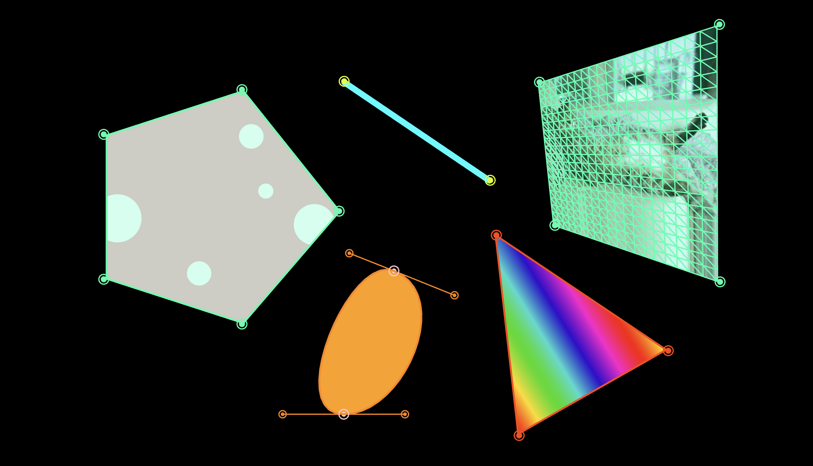
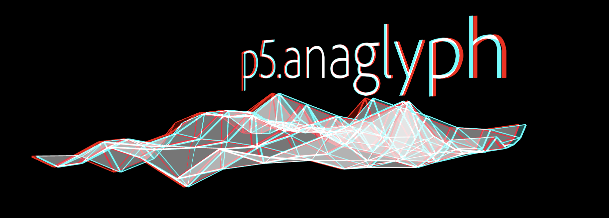

# jilu0503_9103_tut5

## Part1. Imaging Technique Inspiration

**1-1 Zach Lieberman's Reflection Studies**

I was inspired by Zach Lieberman's Reflection Studies project, in particular his use of light and shadow reflections to create abstract visual effects. This technique creates a dynamic visual representation through the interaction between light and objects. I hope to apply this dynamic effect of light reflection to my project to express the interaction between virtual space and reality. This technique will help me explore how animation and visual reflections can create a compelling visual experience and enhance the immersion of my project.

**1-2 The examples I found**

[The link of Zach's work 1](https://www.instagram.com/reel/C_6cFIzJtPh/)

[The link of Zach's work 2](https://www.instagram.com/reel/C_749dkp6_I/)

## Part2. Exploring Coding Techniques

To achieve dynamic visual effects similar to Reflection Studies, I'm going to use the p5.mapper and p5.anaglyph libraries, tools that provide unique visual presentation capabilities in p5.js.

**2-1. p5.mapper**

p5.mapper is a library for projection mapping in p5.js. It makes it easy to project images on irregular surfaces, creating dynamic visual effects by mapping the image to a specified surface using geometric transformations.

[The link of code example 1](https://github.com/jdeboi/p5.mapper)

**2-2. p5.anaglyph**

p5.anaglyph is a library for creating red and cyan stereoscopic images that can be viewed in 3D through red and cyan glasses. This technique creates stereoscopic sensations in a two-dimensional picture, simulating reflections and depth effects.

[The link of code example 2](https://github.com/jdeboi/p5.anaglyph)
